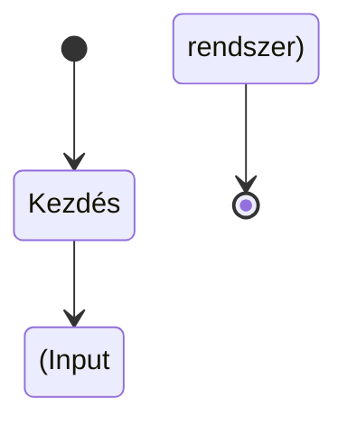

# KodersBase - Secret of the Mist

> Készítette: Szelinger Annamária - Fejes Gergő - Birkás Zoltán

## A projektről (tervek szerint)

- Egy **story** típusú játék, ahol karakterünknek fel kell fedeznie egy rejtélyes hegyvidéket

- A történet során különböző képességekre tesz szert, hogy minél nagyobb esélyekkel túlvészelje a hegyvidék megpróbáltatásait

- Egyszemélyes játékélmény PC-n akár billentyűvel, akár kontrollerrel

- Komponensek:

- [ ] 

## Használt programok

- Unity 2021.3.1f1

- Blender

- MarkText

- paint.net

## Mérföldkövek

## DEMO

fwefmwpfwm

fwfpwpfwm
