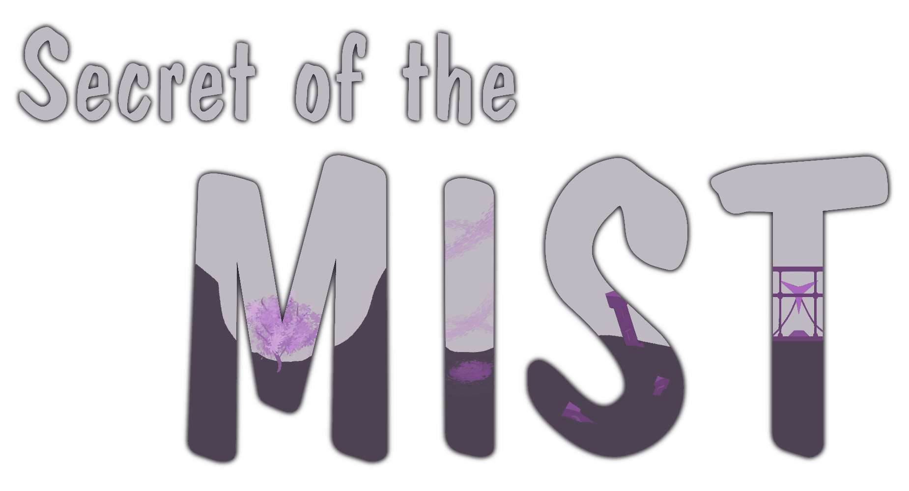

# KodersBase - Secret of the Mist

## A projektről (tervek szerint)

> - Egy **story** típusú játék, ahol karakterünknek fel kell fedeznie egy rejtélyes hegyvidéket
> 
> - A történet során különböző képességekre tesz szert, hogy minél nagyobb esélyekkel túlvészelje a hegyvidék megpróbáltatásait
> 
> - Egyszemélyes játékélmény PC-n akár billentyűvel, akár kontrollerrel
> 
> - Komponensek
>   
>   - Kétféle irányítás
>   
>   - Harcrendszer
>   
>   - AI
>   
>   - Inventory
>   
>   - Küldetések
>   
>   - Képességek
>   
>   - Stats (=életerő, mana, stb...)

## DEMO

fwefmwpfwm

fwfpwpfwm
